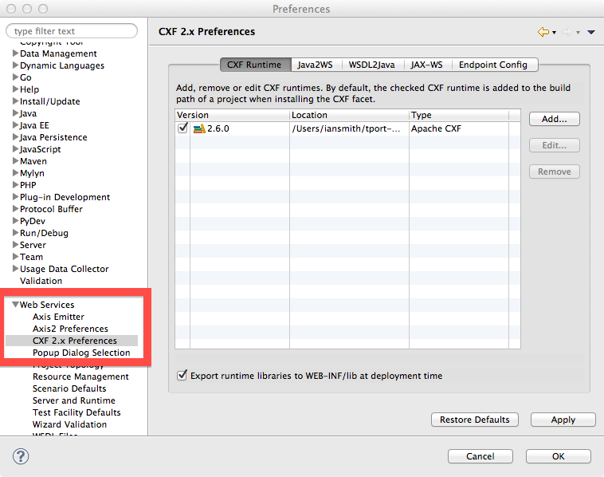
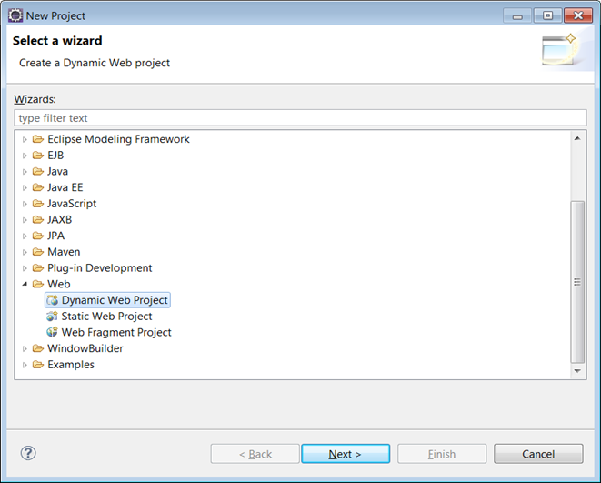
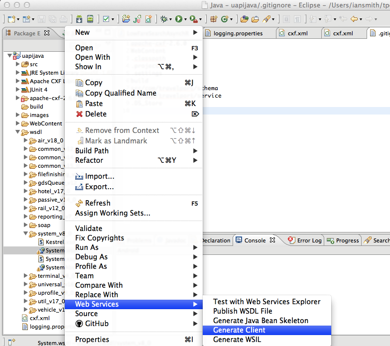
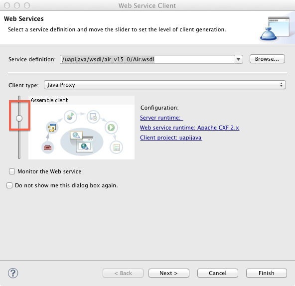
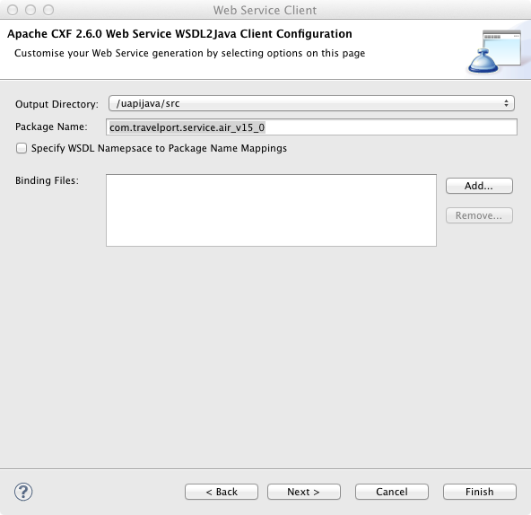
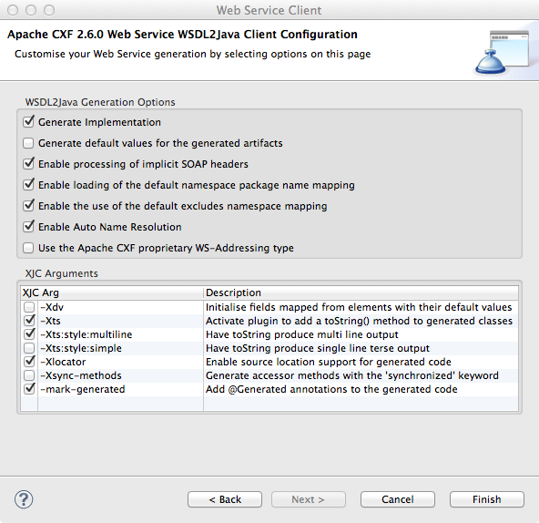
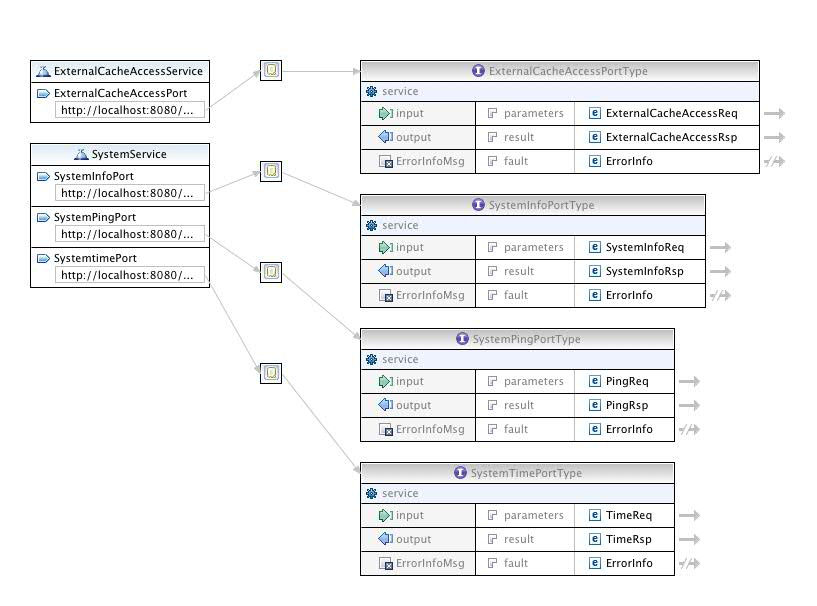
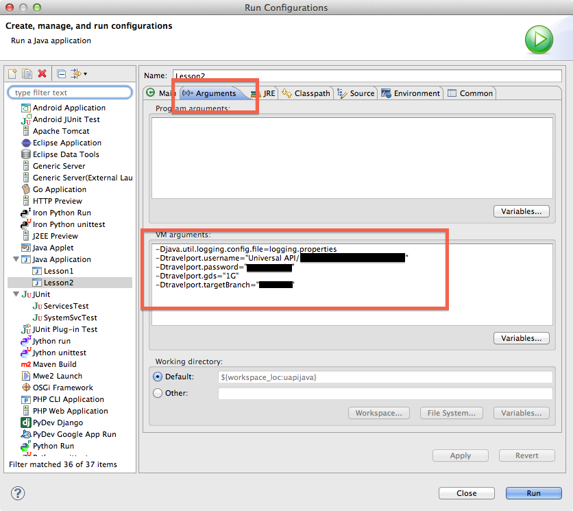



##  Unit 1, Lesson 1

### Objective of Unit 1

After working through the three lessons of Unit 1, you can work with Travelport Universal API to make requests for services and understand the responses.

### Programming language agnostic and WSDL

Although these lessons are using Java, the lessons' concepts apply to most programming languages.  The _interface_ to Universal API is defined with [WSDL](http://en.wikipedia.org/wiki/Web_Services_Description_Language) or Web Services Definition Language.

This means that any programming language that knows how to use *web services* can access the APIs and get useful things done.  In practice, this means that you need a _generator_ that can take a file "foo.wsdl" and spit out "foo_client.Java", or whatever, in your favorite language.

Note: different generators have slightly different behaviors. WSDL is a standard, but some differences occur when dealing with multiple versions and different versions implemented by different vendors. In this tutorial, [Apache's CXF](http://cxf.apache.org/) is used to work with the Universal API in Java. "CXF" is not an acronym, but is related to the project's origin.

### Requesting 30-day trial credentials

You must first create an account on [Travelport Developer Network](http://developer.travelport.com).

* Once you have an account, access the link to *Request Test Access* in the *Tools and Resources* menu on the [Universal API Resource Center](http://developer.travelport.com/app/developer-network/resource-centre-uapi).

* When you request test credentials, select *Galileo* as your preferred GDS.

* After you complete the form, you'll receive an email from *webmaster@travelport.com* with the relevant information.

### Downloading the tutorial code

You can download the tutorial code using *github* to clone the repository. You can use your favorite [git tool](https://git.wiki.kernel.org/articles/i/n/t/Interfaces,_frontends,_and_tools.html) or use the command line like this:


mkdir learn-tport
cd learn-tport
git clone git@github.com:Travelport/travelport-uapi-tutorial.git


This last command creates the directory `travelport-uapi-tutorial`. Within that directory you can find the directories `src` and `wsdl` in addition to other files. In the `wsdl` directory, are many WSDL files as well as a number of [XML schemas](http://en.wikipedia.org/wiki/XSD), as `xsd` files.  All of these files are supplied by Travelport, and the latest version of Travelport Universal API can be downloaded from [the Travelport Developers site](http://developer.travelport.com).

Also, you can download the `wsdl` files from [the UAPI Help site](https://support.travelport.com/webhelp/uapi/uAPI.htm#Getting_Started/Universal_API_Schemas_and_WSDLs.htm%3FTocPath%3DGetting%2520Started%7CGetting%2520Connected%7C_____2).

For the rest of the tutorial we'll assume that you created a Java (or web services) project in Eclipse and put all the  code provided by tutorial at the top level of the project.  A `src` and a `wsdl` directory displays when you have done this correctly.

### Apache CXF

Apache's CXF is the critical glue for connecting Travelport's web services to the Java tutorial code. There are many other choices for interacting with web services in Java, but CXF is a very popular one.

You'll need to [download and install](http://cxf.apache.org/download.html) the Apache CXF code. This tutorial requires at least version 2.7.10.

### Programming Environment

The tutorial has been created using Apache CXF Library 2.7.12. The Java system libraries used is JDK1.7.0_40 and Apache Tomcat version 7.0. If you face any issues with environment, schema, Client code generation related issues please open an issue in the GitHub.

#### Using Eclipse

If you are using [Eclipse](http://www.Eclipse.org), you can install the CXF directly into Eclipse by going to "Preferences > WebServices". If you don't have this preference option, you need to install the [Web Tools Platform](http://www.Eclipse.org/webtools/), or WTP, for Eclipse. The preferences screen where you add your installation of CXF should look something like this (with the preference choice highlight by the red box).  

 

 

#### Not using Eclipse

If you are not using Eclipse, you need to be sure that the CXF jar files are [in your classpath](http://docs.oracle.com/Javase/tutorial/essential/environment/paths.html) and that you can run the command 'cxf' from the command line.

Be aware that there many Java libraries that are "subsumed" by CXF, so you'll end up with about 75 libraries in your classpath.

### Creating a Project

One critical thing about creating a project inside Eclipse that is each type of project has what Eclipse calls a _nature_. A nature controls what functions are available for a given project. For example, a C++ project has different capabilities/functions than a Ruby project. You must create a "Dynamic Web" services project from the "New > Project" menu.

 

 

##### Juno v. Indigo

On [June 27, 2012](http://www.eclipse.org/org/press-release/20120627_junorelease.php), the [Eclipse project](http://www.eclipse.org/eclipse/) released [version 4.2](http://www.eclipse.org/downloads/) of Eclipse, named ['Juno'](http://www.eclipse.org/juno/). If you are using this version of Eclipse, you  want to use the [Java for J2EE Developers Bundle](http://www.eclipse.org/downloads/packages/eclipse-ide-java-ee-developers/junor) and then verify that you have enabled the WTP, or [Web Tools Platform](http://www.eclipse.org/webtools/), version 3.4.

You can also use Eclipse Kepler.

### Generating a Java Client for Travelport Universal API

We now need to generate Java code from the WSDL and XSD files supplied by Travelport's Universal API.

Begin by generating the Java code for the `System` service. In Eclipse, you do this by selecting the WSDL file `System.wsdl` in the directory `wsdl/system_v8_0` and then using the context-menu in Eclipse to choose *Generate Client*, as shown here:

 

 

You are then presented with a sequence of three dialog boxes connected by hitting the *Next* button. The vast majority of these options are not applicable for this tutorial, but you can verify your configuration against this set of screenshots:

 

 

 

 

On the first screenshot in this sequence, the red box indicates a slider.  This slider can be moved to another position, the *non-error* position, if you prefer to not display *errors* on your screen.

The last dialog box displays a number of selected checkboxes. These control various options in CXF's generation of the Java code. The lower set of checkboxes that are checked (such as -Xts and -Xts:multiline) are not crucial to have the tutorial work properly, but do make debugging easier.

#### Command Line Generation of a Java Client

If you are using the command line, you can manually do what Eclipse does behind the scenes based on the values given in these dialogs. Below is a complex command line generated by Eclipse that you can start from, although you need to adjust the paths to your local machine. 


wsdl2Java -client -d /Users/johndoe/tport-workspace/uapiJava/.cxftmp/src -classdir /Users/johndoe/tport-workspace/uapiJava/build/classes -p http://www.travelport.com/service/system_v8_0=com.travelport.service.system_v8_0 -impl -validate -exsh true -dns true -dex true -autoNameResolution -xjc-Xts,-Xts:style:multiline,-Xlocator,-mark-generated -wsdlLocation http://localhost:8080/kestrel/ExternalCacheAccessService?wsdl -verbose -fe jaxws -db jaxb -wv 1.1 file:/Users/johndoe/tport-workspace/uapiJava/wsdl/system_v8_0/System.wsdl


### Client for *System*

If you use the WDT viewer for a WSDL file, this image displays when you open `wsdl/system_v8_0/System.wsdl`. There are tabs at the bottom of the main editor view to control whether you view this file in *design view* or as a normal source code file.

 

 

This diagram shows you that there are two *services* exposed by`System`: `ExternalCacheAccessService` and `SystemService`.  Often we will get sloppy with the nomenclature and refer to the "system service" as any object that is accessible from objects _generated from the System.wsdl file_.  In this case, the real, concrete class `SystemService` is derived from `System.wsdl` so there is less confusion, but this can become more confusing with other WSDL files, like `Air.wsdl`, that expose many "services" as a by-product of generating the code for the "Air service." Whew, a lot of uses of "service"!
 
The remainder of this lesson works primarily with `SystemService`.

You can view the Java code generated for this service in your project's `src` folder, the class `com.travelport.service.system_v8_0.SystemService`.  You can *safely ignore* all the implementation details about this service.

Referring back to the diagram for `SystemService` above, there are three *ports* exposed by the `SystemService`: `SystemInfoPortType`, `SystemPingPortType`, and the `SystemTimePortType`. In the code for this lesson, we'll run a simple ping request through the `SystemPingPortType`.

### The Other Services in Unit 1

A number of services are used in Unit 1, and you need to generate all the necessary code for them. Repeat the process of generating client code explained previously with the *Air* service in src/wsdl/air_v26_0/Air.wsdl, the *Hotel* service in src/wsdl/hotel_v26_0/Hotel.wsdl, the *Vehicle* service in src/wsdl/vehicle_v26_0/Vehicle.wsdl, and the *Universal* service in src/wsdl/universal_v26_0/UniversalRecord.wsdl.

### The Programming Model

The pattern used by Travelport Universal API design is to expose a *port* which has a single method called *service*.  No matter what programming language you use, these are the same and most programming languages use the terminology of a *method* or a *function call* to refer to make a request over the network via the given port.

Usually we refer to the port object just by its name, without any prefix or suffix, as *the ping port*, or just *ping*. All the ports exposed from the file `System.wsdl` start with `System` and end with `PortType` when generated Java code is produced.  These names should be the same in almost any programming language generated from this WSDL.

The ping port's only method is `service`, as you can see from the diagram. The diagram displays the input and output parameters `PingReq` and `PingRsp`, for the request and response respectively.  The source code generated for these classes can be found in the `src` Java folder with the name `com.travelport.schema.system_v8_0.PingReq`, or you can explore them with design view of `System.wsdl`.  

The structure of the `PingReq` and `PingRsp` object are specified to XML inside the XSD file `src/wsdl/system_v8_0/System.xsd`. The XSD files define various types used in the WSDL files, and the WSDL reference these XSDs to *import* these definitions.  Here are the definitions for `PingReq` and `PingResp`.

#### Ping Request/Response as defined in XML


<xs:element name="PingReq">
    <xs:annotation>
        <xs:documentation>A simple request to test connectivity to the system without imposing any actions</xs:documentation>
    </xs:annotation>
    <xs:complexType>
        <xs:complexContent>
            <xs:extension base="common:BaseReq">
                <xs:sequence>
                    <xs:element ref="Payload" minOccurs="0" />
                </xs:sequence>
            </xs:extension>
        </xs:complexContent>
    </xs:complexType>
</xs:element>
<xs:element name="PingRsp">
    <xs:annotation>
        <xs:documentation>Response to the PingReq. Will contain the exact payload (if any) that was sent in</xs:documentation>
    </xs:annotation>
    <xs:complexType>
        <xs:complexContent>
            <xs:extension base="common:BaseRsp">
                <xs:sequence>
                    <xs:element ref="Payload" minOccurs="0" />
                </xs:sequence>
            </xs:extension>
        </xs:complexContent>
    </xs:complexType>
</xs:element>


If the details of the implementation are not important to you, you can just _use_ these facilities as part of Travelport Universal API.  If you are interested in the implementation details, here is some slightly-edited, generated Java code derived from the ping request definition:



public class PingReq extends BaseReq
{
    protected String payload;
    /**
     * Gets the value of the payload property.
     */
    public String getPayload() {
        return payload;
    }

    /**
     * Sets the value of the payload property.
     */
    public void setPayload(String value) {
        this.payload = value;
    }

}



### Using the System Service

We now have the logical pieces necessary to understand how to use functionality exposed by Travelport Universal API. Below is an example of a sequence of actions with the ping port:

1. Create an object of type `PingReq`.
2. Fill in the necessary fields of the `PingReq` using its *setter* methods
3. Create an instance of `SystemService`.
4. Access the `SystemService` object to get an object of type `SystemPingPortType`.
5. Call the method `service` on the `SystemPingPortType` instance, passing the `PingReq` object created in step 1.
6. Examine the results of the request by looking at the `PingRsp` object using its *getter* methods.

With very few exceptions, all the features and functions of Travelport Universal API follow this pattern of first build the request parameters and then use the port object to get the results.

### Lesson 1

The file  [Lesson1.Java](https://github.com/travelport/travelport-uapi-tutorial/blob/master/src/com/travelport/uapi/unit1/Lesson1.Java) is in the Java package [com.travelport.uapi.unit1](https://github.com/travelport/travelport-uapi-tutorial/tree/master/src/com/travelport/uapi/unit1).  You'll notice that in the web-viewable version of this tutorial, we often make the names of files and packages direct links into the github repository for the tutorial.  This makes it easy for those that just want to read the tutorial by compiling/running all the examples.

Let's examine the `main` method of Lesson 1:



public static void main(String[] argv) {		
	//
	// PING REQUEST
	//
	String payload= "this my payload; there are many like it but this one is mine";
	String someTraceId = "doesntmatter-8176";
	
	//set up the request parameters into a PingReq object
	PingReq req = new PingReq();
	req.setPayload(payload);
	req.setTraceId(someTraceId);
	
	try {
		//run the ping request
		PingRsp rsp = WSDLService.sysPing.get().service(req);
		//print results.. payload and trace ID are echoed back in response
		System.out.println(rsp.getPayload());
		System.out.println(rsp.getTraceId());
		System.out.println(rsp.getTransactionId());
	} catch (SystemFaultMessage e) {
		//usually only the error message is useful, not the full stack
		//trace, since the stack trace in is your address space...
		System.err.println("Error making ping request: "+e.getMessage());
	}
}



The code in `main()` above follows the pattern explained in the programming model section: a `PingReq` object is set up with the proper parameters and then passed through to Travelport Universal API via the ping port.

The only unexpected part of this example is the call to `WSDLService.sysPing.get()` that returns the ping port object. This is a shorthand for getting the "sys" service and then getting the "ping" port (thus `WSDLService.sysPing`). The `get` method on this object caches both services and ports so further calls to get return the same port on the same service. These are expensive to create, so this is the preferred behavior. You may find it useful to your understanding and debugging to call `showXML` on the object that responds to `get`--the _wrapper_ of the port object, not the port itself--so you can see the actual incoming and outgoing XML.

`WSDLService` is a helper class that has been provided with the tutorial to simplify things, and allow you to focus on the essential parts of Travelport Universal API.

### The details

You need to configure your copy of the class `WSDLService` slightly to allow you to use Travelport Universal API.

If you look inside [WSDLService](https://github.com/travelport/travelport-uapi-tutorial/blob/master/src/com/travelport/tutorial/support/ServiceWrapper.java) in the package [com.travelport.tutorial.support](https://github.com/travelport/travelport-uapi-tutorial/tree/master/src/com/travelport/tutorial/support) you see the things you might need to change.  

If completing the lessons in this tutorial, youd need to change this:


//make this point to the right path for you... note the slash on the end
static public String URLPREFIX = "file:///Users/iansmith/tport-workspace/uapijava/";



If you want to use endpoints other than the ones that are the default for test credentials you may need to modify this part:



// these endpoint parameters vary based on which region you are
// in...check your travelport sign up to see which url you should use...
// use the version with copy in the name for test credentials... 
// note trailing slash!
static public String ENDPOINT_PREFIX="https://emea.copy-webservices.travelport.com/B2BGateway/connect/uAPI/";



The URLs derived from the prefix above are called *endpoints* in the parlance of WSDL. This prefix may need to be changed if you are not in the EMEA (_Europe, Middle East, and Africa_) geography. The functionality is the same from any endpoint, the only difference is which servers are used to provide the functionality.

If you try to run the `Lesson1` code either from the command line or from Eclipe's Run menu you'll get an error like this:


Exception in thread "main" Java.lang.RuntimeException: One or more of your properties has not been set properly for you to access the travelport uAPI.  Check your command line arguments or Eclipse run configuration for these properties:travelport.username,travelport.password,travelport.gds,travelport.targetBranch


This error indicates that you have not set some *Java properties* (often done using the -D option from the command line) in your Run configuration. You access or create run configurations in Eclipse with *Run* then *Run Configuration...* from the primary Eclipse menubar. Here is a screenshot of how to configure your environment via the *Arguments* tab and supplying *VM arguments*:

 

 

The red boxes show you the tab you need to use to get to this configuration option and where to supply the values.

The values are included in your sign-up documents from the Travelport website.  Note that each of the parameters is of the form -Dxxx="yyy" and are separated by spaces.  The values are always quoted and the names always begin with "travelport".

After you make the necessary adjustments for your account, return to the [WSDLService](https://github.com/travelport/travelport-uapi-tutorial/blob/master/src/com/travelport/tutorial/support/WSDLService.java) file.  The `URLPrefix` value is set like the image below near the top of the file:


static protected String URLPREFIX = "file:///Users/iansmith/tport-workspace/uapiJava/";


This example shows a path on the tutorial developer's home machine.  You need to adjust this to be the prefix of a URL that points to the root of your project. Note that URLs start with "file:///"  and use forward slash (/) to separate directories, even if you are running on the Windows operating system. You need to be sure to include a trailing slash as well, because various other values are derived from `URLPREFIX` by concatenation.

After you make this adjustment, you can run Lesson 1 via your run configuration created above. If you see an error like this:



Exception in thread "main" Javax.xml.ws.WebServiceException: org.apache.cxf.service.factory.ServiceConstructionException: Failed to create service.
	at org.apache.cxf.jaxws.ServiceImpl.<init>(ServiceImpl.Java:150)
	at org.apache.cxf.jaxws.spi.ProviderImpl.createServiceDelegate(ProviderImpl.Java:97)
	at Javax.xml.ws.Service.<init>(Service.Java:56)
	at com.travelport.service.system_v8_0.SystemService.<init>(SystemService.Java:41)
	at com.travelport.uapi.unit1.WSDLService.getPing(WSDLService.Java:133)
	at com.travelport.uapi.unit1.Lesson1.main(Lesson1.Java:23)
Caused by: org.apache.cxf.service.factory.ServiceConstructionException: Failed to create service.
	at org.apache.cxf.wsdl11.WSDLServiceFactory.<init>(WSDLServiceFactory.Java:94)
	at org.apache.cxf.jaxws.ServiceImpl.initializePorts(ServiceImpl.Java:204)
	at org.apache.cxf.jaxws.ServiceImpl.<init>(ServiceImpl.Java:148)
	... 5 more
Caused by: Javax.wsdl.WSDLException: WSDLException: faultCode=PARSER_ERROR: Problem parsing 'file:/Users/iansmith/tport-workspace/uapiJava/wsdl/system_v8_0/System.wsdl'.: Java.io.FileNotFoundException: /Users/iansmith/tport-workspace/uapiJava/wsdl/system_v8_0/System.wsdl (No such file or directory)
	at com.ibm.wsdl.xml.WSDLReaderImpl.getDocument(Unknown Source)
	...


you have misconfigured the `URLPREFIX` above and you need to re-check the value you gave for it. It should point to the directory that is the _parent_ of the `wsdl` and `src` directories in your project.

	Some may be curious how the `WSDLService` object works.  This tutorial depends critically on the fact that there is a common, regularized naming scheme for entities in Travelport Universal API. Because of this fact, it can use Java's reflection capabilities to essentially "guess" what the name of a given service and port will be. It guesses the name, then verifies that its guess is correct and returns the appropriate object to the caller. This avoids the problem that new Universal API developers might have navigating through all the objects in Travelport Universal API to find the appropriate services.

### The pay-off

You can now run `Lesson1` and see this output like this:


this my payload; there are many like it but this one is mine
doesntmatter-8176
E07E825F0A07580E004DED8EB9130465


The last value is a _transaction ID_ that is unique to each call on Travelport Universal API, so it will differ from what is displayed above.

When you see this output, you have run a *ping* to the Travelport service and successfully gotten back the values transmitted. This means that all the layers of software and networking between your computer and Travelport's servers are working as expected.

### Other Output

You may also see some messages (usually in red, because they are directed to the system's default error log) like this in your Eclipse console:


INFO: Creating Service {http://www.travelport.com/service/system_v8_0}SystemService from WSDL: file:/Users/iansmith/tport-workspace/uapiJava/wsdl/system_v8_0/System.wsdl


This is a message provided by the CXF framework explaining it is creating a service based on a WSDL file and providing some information about the endpoint it is using. You can control the amount of information from the CXF infrastructure by adjusting the values in the [logging.properties](https://github.com/travelport/travelport-uapi-tutorial/blob/master/src/com/travelport/uapi/unit1/logging.properties) file. Most people can safely ignore these messages, unless they are printed out to the `Warning` or `Error` logging levels.

### Seeing the XML Exchanged

If you'd prefer additional information from the CXF layer and have it display the XML/SOAP messages that are being exchanged, add this line in main before the call to `service()`:


WSDLService.sysPing.showXML(true);


This `showXML` function is available for any port used in this tutorial.  Setting this to `true` dumps out to the terminal the *raw* messages that are being exchanged between your workstation and Travelport Universal API. Lesson 1 looks something like this:


<soap:Envelope xmlns:soap="http://schemas.xmlsoap.org/soap/envelope/">
  <soap:Body>
    <ns2:PingReq xmlns="http://www.travelport.com/schema/common_v12_0" xmlns:ns2="http://www.travelport.com/schema/system_v8_0" TraceId="doesntmatter-8176">
      <ns2:Payload>this my payload; there are many like it but this one is mine</ns2:Payload>
    </ns2:PingReq>
  </soap:Body>
</soap:Envelope>

<SOAP:Envelope xmlns:SOAP="http://schemas.xmlsoap.org/soap/envelope/">
  <SOAP:Body>
    <sys:PingRsp xmlns:sys="http://www.travelport.com/schema/system_v8_0" TraceId="doesntmatter-8176" TransactionId="0495F2D20A07611101023661E1B891C2">
      <sys:Payload>this my payload; there are many like it but this one is mine</sys:Payload>
    </sys:PingRsp>
  </SOAP:Body>
</SOAP:Envelope>


### Exercises for the reader

 * Create a run configuration as above but for the [SystemSvcTest](https://github.com/travelport/travelport-uapi-tutorial/blob/master/src/com/travelport/uapi/unit1/SystemServiceTest.Java) test code. This is a JUnit4 style test suite and requires the appropriate configuration type in the Run Configurations menu.

 * Change the ping values in `Lesson1` and prove to yourself that the values being returned are the values you supplied.

 * Modify the code in Lesson1 to use the *time port* (`SystemTimePortType`). This requires that you discover how to get access to different ports (via the `WSDLService` helper class), and that you supply different request and response types to match the appropriate types for this different function. The `time port` returns the current time according to Travelport if you succeed in calling it.

----------------------

[Proceed to Unit 1, Lesson 2 >](lesson_1-2.html)

[Table of Contents](index.html)




