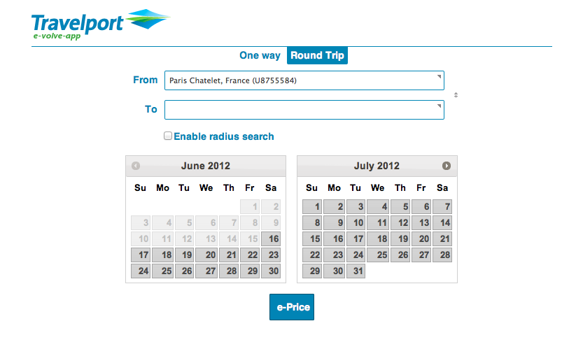
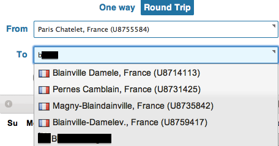
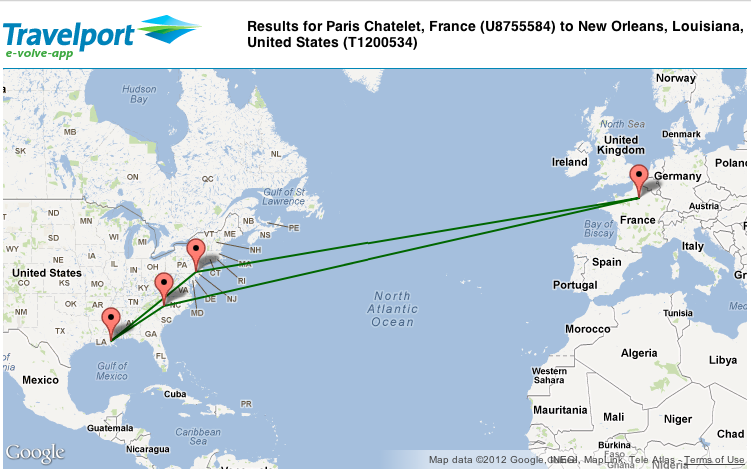
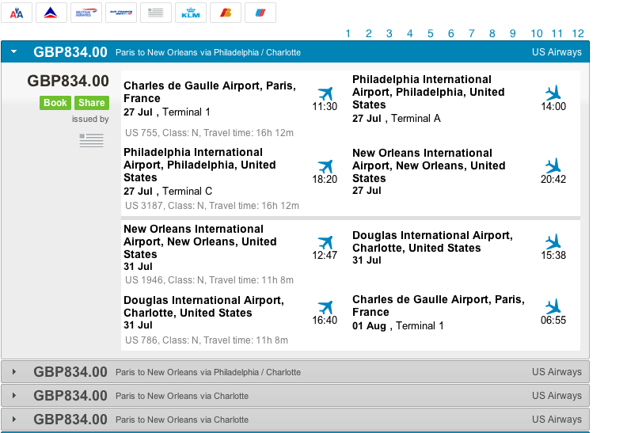
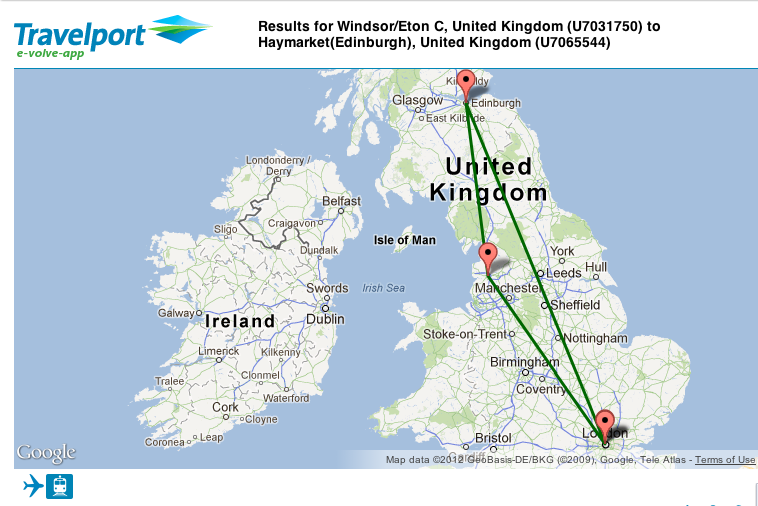
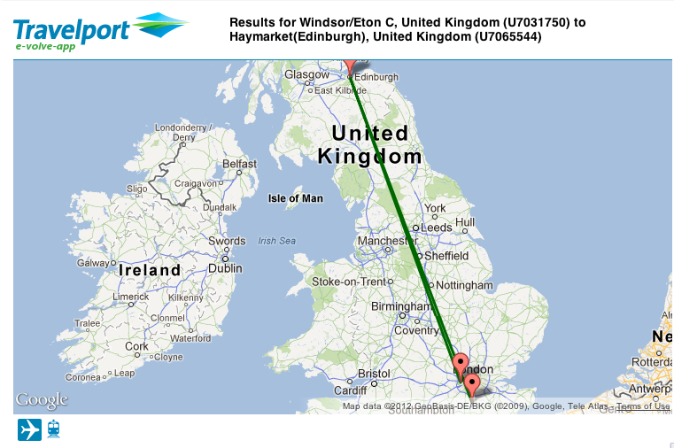
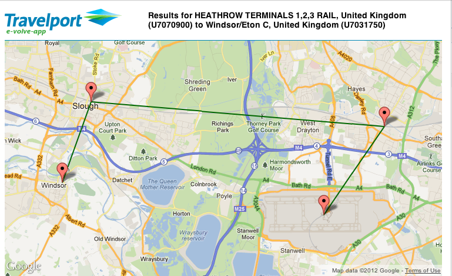
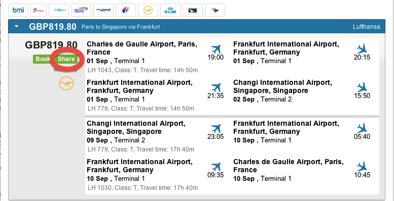
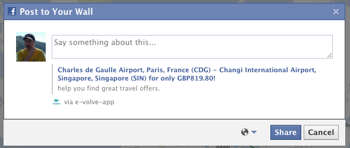



## Unit 3, Lesson 6

### Objective of Lesson 6

In this lesson, we'll document the "behind the scenes view" of Travelport's E-volve Facebook app.

We'll focus on how it works and how it uses the uAPI to do its work.  

### Starting up

You can access the Facebook app on the URL `http://apps.facebook.com/travelportapp/`.

Note that this is an "http", not "https" URL.  You'll be presented with a first screen that looks like this, except with your location in the "From" field.

 

 

The "From" field is populated with the location based on the value in your Facebook profile.  In [Lesson 8](lesson_3-8.html), we'll detail how to do Facebook queries to determine information like this.  The "To" field is for you to put a destination. Don't forget to indicate the dates of your round-trip travel.  

### Destinations

The "To" field in the screen capture above allows you to type a location in, as you would expect.  However, you'll notice that the system auto-completes both on locations _and_ on your friends names, as in "B--" here:

 

 

In the image you can see some locations in France as well as 'Bob Smith', a friend of the author. You can use this app to either travel to locations like Pernes Camblain in France or to the location registered in Blaine's Facebook profile as his "location" or his "hometown".   

In Lessons 8 and 9, we'll cover how to find these location in more detail, but in general these locations are products of the Travelport "UCode" database.  You will notice the "U87XXXX" numbers to the right of the locations in France.  This indicates the number of a particular train station in the UCode database.  The E-volve application is querying the UCode data with a search that says, in simple terms, "if any part of the name of the city of a train station or airport has the letters B-L-A-I-N in it, show it to the user."  (If you are familiar with SQL, this is an 'like' query with wildcards.)

### Showing the travel route on a map

Continuing this example, we have chosen "Blaine Stanga" from the pull down menu and chosen a set of days at the end of July to go for a visit.  We are then shown the results of doing a Travelport shopping request, more specifically a Low Fare Search, as we discussed in [Lesson 3](lesson_1-3.html).

This search uses the origin and destination provided in the fields, plus the dates indicated via the calendar section.   After you click the e-Price button you'll see a map like this, indicating the route for the lowest priced result:

 

 

The map above is generated by parsing the `AirSearchRsp` object and examining the `AirPricingResult` collection.  As we explored in [Lesson 2](lesson_1-2.html), it's necessary to reconstruct each `AirSegment` object that is part of the journey and find its origin and destination airport.  In the map above, the trip from Paris to New Orleans is via Philadelphia and the return is via Charlotte.  You can see the different outbound and return paths with the green lines on the map.

### Showing the travel details

 

 

Below the map, you'll see the details of the journey, as in the screen capture above.  You can see the price of the journey indicated (834 GBP) as well as the icon of US Airways who is the operating carrier of these flights, and each flight's details such as class of service, dates, duration of flights, flight numbers, planned departure times, etc.

These details are derived in a way similar to our `PrintableItinerary` in [Lesson 3](lesson_1-3.html), although these are styled for better interaction.  In summary, the `AirSegment` object's fields are interrogated with methods like `getFlightNumber()` and `getFlightTime()` to extract these details.  It is also possible to differentiate between the issuing carrier and operating carrier through methods on the `AirSegment`, which is how the icon for US Airways was chosen in the screen capture.

### Filtering the results

For the convenience of the E-volve application's user we offer some front-end filtering capabilities, although they don't depend on capabilities of the uAPI _per se_.

In the above screen capture, you'll see icons of airlines in the upper left corner.  These icons filter the results displayed to include just those that involve that carrier.  

Since the `AirPricingSolution` returned includes a large number of solutions, the E-volve application can create the set of icons as soon as we have received the result from the `AirService` endpoint using the `LowFareSearch` port.  Similarly, the pages (indicated by "1 2 3... 12" in the upper right of the screen capture) are just for the user interface.  We have already received all the results in response to our shopping query and these are stored so the "pages" just permit the user to navigate through these results.

### Rail, automatically

As we discussed when we covered mixed rail and air searches in Lesson 3, the uAPI is capable of searching for both rail and air travel simultaneously.   We can see the comparison of the two means of transport when looking at these two screen captures.

 

<h4>Rail From London (Euston) to Haymarket Street Station, Edinburgh, via Preston.  Return direct Haymarket Street to London (Kings Cross)</h4>
 
 

<h4>Air From London To Edinburgh, Outbound From Gatwick, Return to Heathrow</h4>
 

There are two things to note about these solution images: 1) In the lower left, the Travelport E-Volve app has an icon indicating the type of solution (air or rail) and by clicking on it you can filter for a particular type of transport.   2) These searches were not done from London on departure, but rather from the suburban stop of Windsor/Eton Central.  This is indicated in the titling at the top of the screen captures.

We have explored previously that a low-fare search can search for results that include "nearby" stations.  This is done by using the `setMaxDistance` option and providing a distance (in KM or MI) when creating the "TypeSearchLocation" portion of an XML request.  Although E-volve produced nice results, we could clearly improve this itinerary.

### Door To Door Itineraries

With the baseline itinerary established above, we can do a secondary query to get the traveller to and from his or her exact origin in Windsor/Eton.  For this example, we'll do a search from London's Heathrow Rail Station (U7070900) to the "true" destination on the way back (U7031750).  

 

 

The screen capture shows the journey from the airport to Windsor/Eton, via Hayes & Harlington and Slough. 
Although this journey has two stops, the total travel time is about 50 minutes---data we got via the `RailJourney` object!  This additional query to the uAPI creates an itinerary that almost drops the user at their door in Windsor.

By using the Universal Record portion of the uAPI you can even combine these rail segments with the air segments into a [single record](http://support.travelport.com/webhelp/uapi/Content/Getting_Started/Before_You_Begin/Universal_Records_and_PNRs.htm) and provide a unified itinerary to the traveller.

### A little bit more Facebook

Up to this point, this Facebook app has used features of the uAPI and that are quite similar to those we have used in our previous lessons.  In addition, the E-volve application has used the UCode data to determine better search targets.   The UCode database, though, is provided by Travelport not Facebook.  About the only part of this app, to this point, that truly is tied to Facebook is the ability to filter your origin and destination by Facebook friends and other Facebook entities, such as places.  

We can also post events to the Facebook timeline of the user since the application runs "inside" Facebook.  We have highlighted the "Share" button on the screen capture of the details section of the E-Volve app.  

 

 

This button results in the typical Facebook dialog that allows a user to comment on data to be posted on their Facebook timeline.

 

 

This actually works via the Facebook javascript API using the call `FB.ui()`.  When you have content in the user interface that you have created via the uAPI you can do something like this to post it to the user's Timeline:


function postToFeed() {

  // calling the API ...
  var obj = {
    method: 'feed',
    link: 'reference back to your application in Facebook?',
    picture: 'map of itinerary and stops?',
    name: 'My Application?',
    caption: 'My customer is travelling?',
    description: 'Details about where and when the customer is travelling?'
  };

  function callback(response) {
	//handle the response... there may be an error in posting your content
  }

  FB.ui(obj, callback);
}



### The Future

To summarize what is coming up in the tutorial, we have three more lessons coming up about Facebook and integrating it with the uAPI.  We'll first detail how to build a Facebook application more generally (this is required!), then we'll discuss how to make calls to the Travelport uAPI from inside a Facebook app, and finally we create new, non-blocking UI that is a bit more "map-centric" than the E-Volve app.

----------------------

[< Return to Unit 2, Lesson 5](lesson_2-5.html) | [Proceed to Unit 3, Lesson 7 >](lesson_3-7.html)

[Table of Contents](index.html)





