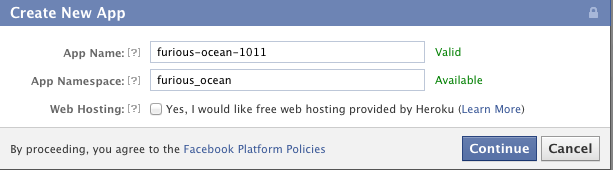
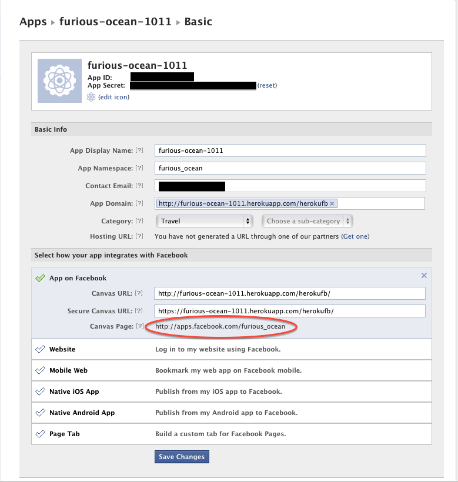
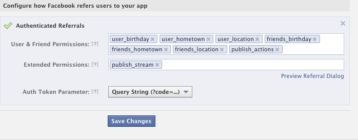
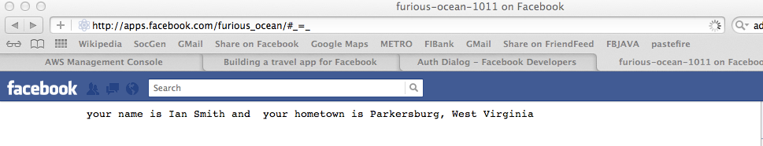



## Unit 3, Lesson 7

### Objective of Lesson 7

In Unit 3 we'll be building a Facebook app that uses the Travelport uAPI to search for travel.

Since the app is to be embedded in Facebook, it will merge social features with travel, with results such as allowing the user to go and visit a friend on his or her birthday.

With that goal in mind, you should be aware that this lesson is not about Facebook's API!

Facebook's "API" must be integrated into an application such as the one we are developing, with the application running on its own server --- and the server must be on the public internet. To be able to implement and run a Facebook app you need the ability to launch an internet-visible server process.  

We need to get a Java program running on the public internet that can _receive_ web requests, or be a _server_ in internet-speak.  Until this point in the tutorial, we have used Java plus WSDL as a _client_ of the Travelport _servers_ that implement the the uAPI.

When completed, Facebook will be making calls as _client_ of _our server_ program.  Although our server is running on the internet _somewhere_, users who interact with our application will see it as being seamlessly inside Facebook.

Our application will have a URL that begins with `http://apps.facebook.com`, for example.  Simultaneously, our application will be a client of the uAPI, as we have done in previous lessons.

### The plan

Because this lesson has a number of fairly complex moving parts, it's important to keep in mind the overall design:
* We'll write our code in Java to handle web requests coming from Facebook.  Our responses to these web requests determine what a Facebook user sees when using the application inside Facebook.
* The [Facebook API](http://developers.facebook.com) is not defined using WSDL like the uAPI.  The Facebook API uses a different mechanism called [REST](http://en.wikipedia.org/wiki/REST).  We'll be using the [Play Framework](http://www.playframework.org/) to do the heavy-lifting at the Web and REST levels.
* Since Facebook applications need to be on the public internet, we are going to use an internet service called [Heroku](http://www.heroku.com) to host our Java application. At the time we write, Heroku is free when the usage of your application is light, so you should be able to the do the tutorial without incurring any costs.
* Facebook makes use of a protocol called [OAuth](http://en.wikipedia.org/wiki/OAuth) to allow the user to control what information an application can receive about them.  [This protocol](http://oauth.net/) depends crucially on cryptography. Thus, we'll need to make use of some of the [deeper layers](http://docs.oracle.com/javase/6/docs/technotes/guides/security/crypto/CryptoSpec.html) of the Java platform.  These can be ignored by most tutorial readers because these tend to "just work, or they don't"; they are intended to _not_ be debuggable.

### Notes on internet protocols and security

For the truly interested in "how it works:"

After generating the client code using a WSDL to Java compiler from Apache's CXF project, our uAPI code in lessons 1 to 6 used the [SOAP](http://en.wikipedia.org/wiki/SOAP) encoding on top of [XML](http://en.wikipedia.org/wiki/XML) being sent over [HTTP](http://en.wikipedia.org/wiki/Hypertext_Transfer_Protocol), the standard protocol for the web.

Since the URLs in use by Travelport are secured using [HTTPS](http://en.wikipedia.org/wiki/HTTPS), eavesdropping is prevented. There is basic security from forgery thanks to a special header included at HTTP-level that includes our Travelport username and password.

For lessons 7-8-9, our code is using [Play Framework](http://en.wikipedia.org/wiki/Play_Framework) to interpret requests and responses at the HTTP level (same as above) as needed to interact with Facebook.  REST is a set of conventions about how to _use_ the HTTP protocol, not a protocol itself.  Play will be responsible for handling the "mechanics" of the REST/HTTP protocol, but it is our responsibility to implement the "semantics" of what we want to achieve in Java.

Facebook's use of OAUTH means that the user must give consent before their data is accessed and must be informed what information is to be released to our application.  Further, no other application may "impersonate" our application and receive data that was intended for our application, nor can other parties eavesdrop on our communication as Facebook also communicates with others via HTTPS.

By way of comparison, both applications use HTTP as the means of transmitting a set of bytes from one point to another, and use URLs as the way to identify with whom one wants to communicate.  The uAPI strategy of using WSDL, SOAP, and XML (as well as explicit versioning) is much safer than the relatively "loose" standard of REST which enforces... nothing --- it's just a set of conventions.

The advantage of REST is the comparative simplicity and ease of implementation compared to the thorough process of using a WSDL-based approach.  Both systems offer reasonable protection from eavesdropping from third-parties, because they are built on top of HTTPS.  Facebook is probably marginally more secure as it prevents impersonation since it requires that messages be "signed" in a way that cannot be forged (although the true risk of this type of attack is certainly very small).

### Play

The Play Framework is a popular Java framework for developing web applications.

Play itself is written in [Scala](http://en.wikipedia.org/wiki/Scala_programming_language), but because Scala is compatible with Java at the binary level, it works for Java as well.

Let's start by getting play installed:  [Download play version 2.0](http://www.playframework.org/download) and follow the installation instructions.  When you have done this successfully, you should be able to run the command `play` from the command line, like this:



$ play help
       _            _ 
 _ __ | | __ _ _  _| |
| '_ \| |/ _' | || |_|
|  __/|_|\____|\__ (_)
|_|            |__/ 
             
play! 2.0, http://www.playframework.org

Welcome to Play 2.0!

These commands are available:
-----------------------------
license            Display licensing informations.
new [directory]    Create a new Play application in the specified directory.

You can also browse the complete documentation at http://www.playframework.org.



Just to be fully sure play is installed properly, let's go ahead and create a bogus project called _deleteme_ :



$ play new deleteme
 _ __ | | __ _ _  _| |
| '_ \| |/ _' | || |_|
|  __/|_|\____|\__ (_)
|_|            |__/ 
             
play! 2.0, http://www.playframework.org

The new application will be created in /Users/iansmith/tmp.unit3/unit3

What is the application name? 
> deleteme

Which template do you want to use for this new application? 

  1 - Create a simple Scala application
  2 - Create a simple Java application
  3 - Create an empty project

> 2

OK, application deleteme is created.

Have fun!



You can, of course, delete "deleteme" now.

You will not need to create an application via play--we've created one already and you can get it from our source code repository; we'll full explain this below.

#### An aside about git

[Git](http://en.wikipedia.org/wiki/Git_software) is a distributed version control system, originally developed by [Linus Torvalds](http://en.wikipedia.org/wiki/Linus_Torvalds) for the Linux kernel.

We are assuming that most developers are familiar with git or at least will be able to "translate" the simple git commands in this lesson, typically just `git commit` and `git push`, into some other version control system they are familiar with.  To learn about git, the best tool is probably the online [git community book](http://git-scm.com/book).

You will need a copy of git installed on your machine, because it is used to trigger the build procedure on a remote machine.  Git will be installed by the next step in this lesson.  Like most version control systems, git has the ability to trigger another program when a `commit` is submitted by a developer.  As we shall see, in git's case this ability is exploited by Heroku.

### Heroku

[Heroku](http://www.heroku.com) is an application hosting service, but at the _programming language_ level, not at the container level (like web application servers), nor at the operating system level.

Heroku itself is built using [Amazon's EC2](http://aws.amazon.com/ec2/) which provides the operating system level hosting (although EC2 is invisible to us in this unit).  Heroku can be thought of as a layer on top of EC2.

#### Sign-up

You'll need to [create an account on heroku](https://api.heroku.com/signup) if you don't have one already.
Accounts can be created without charge.

You'll need to provide your email address during this process. From here on we'll use the notation `youraddress@example.com` to indicate a place where you should supply your email address.

#### Heroku Toolbelt

In terms of your local workstation, the first step in Heroku development is to install the [Heroku Toolbelt](https://toolbelt.herokuapp.com/) as appropriate for your operating system.  This installs the necessary tools so you can interact with heroku from the command line.

#### Match your credentials to your email

Then you need to set up your heroku credentials, including an [SSL](http://en.wikipedia.org/wiki/Secure_Socket_Layer) [private key](http://en.wikipedia.org/wiki/Private_key).  If you are not familiar with this process, just allow heroku to create a new key for you and you can ignore this issue in the future.



$ heroku login
Enter your Heroku credentials.
Email: youraddress@example.com
Password:
Could not find an existing public key.
Would you like to generate one? [Yn]
Generating new SSH public key.
Uploading ssh public key /Users/you/.ssh/id_rsa.pub



#### Get the unit3 source code

For the rest of the tutorial, we'll be using a single play project that we have already created for you.  To obtain this project, you'll probably want to delete (or move) your old copy of the tutorial source code for unit1 and unit2.

Then, you can copy the unit3 source code to your machine from github:



$ git clone git@github.com:Travelport/travelport-uapi-tutorial.git -b unit3

Cloning into 'travelport-uapi-tutorial'...
remote: Counting objects: 2209, done.
remote: Compressing objects: 100% (667/667), done.
remote: Total 2209 (delta 1602), reused 2067 (delta 1460)
Receiving objects: 100% (2209/2209), 10.81 MiB | 384 KiB/s, done.
Resolving deltas: 100% (1602/1602), done.


The exact values of the number of objects or their sizes may vary, but when you are done you will see that the directory `travelport-uapi-tutorial` has been created.  Inside that directory, you'll find the `unit3` directory that is a play project.  You can go into th

#### Create the application "space" on Heroku

A [stack](https://devcenter.heroku.com/articles/stack) in Heroku represents the machinery needed to run an application.  The current stack for running Java applications is called "Cedar".  (Cedar because C is the third letter of the alphabet: the two prior stacks were Aspen and Bamboo).

You should create this stack while inside the directory containing the code for unit 3 (_not lesson 7!_) is prepared for Heroku and Play development. In the next listing this is represented by `path/to/tutorial`:



$ cd path/to/tutorial/src/com/travelport/uapi/unit3
$ heroku apps:create --stack cedar
Creating furious-ocean-1011... done, stack is cedar



The last part will vary for each user that does the tutorial. In our example here, Heroku has chosen `furious-ocean-1011` as the application name for us. These are always two short words plus a number, but yours will be unique.  You can get the details about your application like this. We'll use `furious-ocean-1011` in this tutorial, but you should use your application name.



$ heroku apps:info --app furious-ocean-1011
=== furious-ocean-1011
Domain Name:   furious-ocean-1011.herokuapp.com
Git URL:       git@heroku.com:furious-ocean-1011.git
Owner:         youraddress@example.com
Stack:         cedar
Web URL:       http://furious-ocean-1011.herokuapp.com/



It's worth noting what has just happened here!

Your application has been assigned to a server and can be reached on the public internet with the URL http://furious-ocean-1011.herokuapp.com/. This is it!

### Register your application with Facebook

By going to the Facebook Developer Program [Apps Tab](https://developers.facebook.com/apps/) you'll be presented with a list of all your existing Facebook apps.  Whether you have done one before or not, you can use the "Create New App" in the upper right corner of the page to create a new app registration with Facebook.

  Be sure to *NOT* check the box on this dialog related to Heroku!

 

 

As of 2012, this feature of Facebook will force you to use languages other than Java, such as Python, PHP, or Ruby. When Java becomes supported via this method, it will of course be better than setting up Heroku by hand as we have done above.

Although it is not required that your application name and application namespace be constructed as we have done in this screenshot, this is how we will assume you have done this in the rest of this lesson.  

  Namespaces in Facebook's configuration panel must end with a '/' (slash) character.

The following screen will now appear so you can hook your application to [Canvas Pages](http://developers.facebook.com/docs/guides/canvas/) in Facebook.  Fill in the fields as shown below:

 

 
 
The red-circled part of the screenshot above is the URL where your application will be visible to users. This URL is "inside" Facebook, but all the code will be hosted externally on your Java application running on Heroku.

### Authentication dialogs

Finally, you'll need to configure your [authentication dialog](https://developers.facebook.com/docs/opengraph/authentication/) for Facebook.

Click on the "Auth Dialog" in the upper left of your app settings to edit this. You can ignore most of these  settings, unless you feel obligated or interested in setting them.

The most critical settings are at the bottom of the page as shown here:

 

 

These authentication settings are the ones we'll need in later lessons to get access to the necessary data to mix social networking and travel.  This would probably be a good time to click on the links "Preview Current Dialog" and "Preview Referral Dialog", so you can see how users will perceive your application.

### Setting your Facebook configuration into your app

At the top of the screenshot above, showing how to register a new app in Facebook, there are two "blacked out" fields.  These are two bits of information that you need to "install" into your application, so it knows how to correctly respond to requests sent by Facebook.

It also needs to know the last part of the circled URL in the middle of the same screenshot.  You can do this by using Heroku on the command line.  This process sets environment variables for your application when it runs on Heroku.  Again, you need to be running in the `lesson7` directory inside your copy of the tutorial code:



$ heroku config:add FBSECRET="xxxxxxxxxxxxxxxxxxxxxxxx" --app furious-ocean-1011
Adding config vars and restarting app... done, v3
  FBSECRET => xxxxxxxxxxxxxxxxxxxxxxxx
$ heroku config:add FBAPPNAMESPACE="furious_ocean/" --app furious-ocean-1011
Adding config vars and restarting app... done, v4
  FBAPPNAMESPACE => furious_ocean
$ heroku config:add FBAPPID="xxxxxxxxxxxxxxxxxxxxxxxx" --app furious-ocean-1011
Adding config vars and restarting app... done, v5
  FBAPPID => xxxxxxxxxxxxxxxxxxxxxxxx



   Note that the `FBAPPNAMESPACE` should end with a '/' (slash) character after your app name.

You can check that everything is set correctly with `heroko config --app furious-ocean-1011`


$ heroku config --app furious-ocean-1011
BUILDPACK_URL  => git@github.com:Travelport/heroku-buildpack-scala.git
FBAPPID        => 306675786073601
FBAPPNAMESPACE => furious_ocean
FBSECRET       => 44ea55b78484b3274ff905cdef7d102b



### Setting up your eclipse

The play command knows how to generate proper configuration files for projects that are developed with eclipse.  You can try this with:


$ play eclipsify
[info] Loading project definition from /Users/iansmith/tport-workspace/uapijava/src/com/travelport/uapi/unit3/project
[info] Set current project to unit3 (in build file:/Users/iansmith/tport-workspace/uapijava/src/com/travelport/uapi/unit3/)
[info] About to create Eclipse project files for your project(s).
[info] Successfully created Eclipse project files for project(s): unit3


After you do this, you can use the `File > Import > General > Existing Projects into Workspace`, then "Next" and then selecting Unit 3 as the root directory of this "new" project.  This makes your display a bit easier to understand with the lessons separated out at the top level of eclipse's project navigator.

  You can and should run `play eclipsify` any time you make significant changes to the application.  You should run this command from the root of the play project (the directory `unit3`).  You can do `Refresh` on the project in eclipse to load the changes once you have the project established as above.

### A tiny bit of git magic

To prevent git from becoming confused about the different repositories in use, here are two steps that will "separate" your `unit3` lessons from the rest of the code--at least in git's mind.  You need to edit the .gitignore file at the top of the repository tree you got from [github](http://www.github.com).  Then we'll create a new repository just for our lessons. 

Assuming you are in the `unit3` directory of the source tree, you have edit the `.gitignore` file that is five levels above where you are! It's in the `uapijava` directory that is the top level of everything in this tutorial.  In the example we use `nano` as our editor, but you can use any editor you want to add the line `src/com/travelport/uapi/unit3/` to that file (or uncomment it if it is already there)



$ nano ../../../../../..//uapijava/.gitignore
... add the line src/com/travelport/uapi/unit3 to this file ...
$ # confirm that it is on the end 
$ tail -2 ../../../../../..//uapijava/.gitignore
src/com/travelport/uapi/unit3
$ # tell git to put a temporary repository somewhere else... can be almost anywhere EXCEPT the source tree
$ git init 
$ git add -A
$ # don't forget to change this to your application name...
$ git remote add heroku git@heroku.com:furious-ocean-1011.git
$ # confirm that this did what we wanted
$ git remote -v
heroku	git@heroku.com:furious-ocean-1011.git (fetch)
heroku	git@heroku.com:furious-ocean-1011.git (push)


Now we have created a temporary repository that is holding our heroku-related files, and we have told the primary git 
repository to ignore unit3.  Further, we've now got everything setup to push code to heroku _without_ needing to specify the application name all the time!

## Heroku Love

Let's get hello world working in Facebook!  We need to commit our files to our new repository from the previous step
and then "push" them to heroku.

In the `unit3` directory:



$ git status
# On branch master
#
# Initial commit
... lots more information here about each file ...

$ git commit -a -m "initial commit"
[master (root-commit) 34d1086] initial commit
 13 files changed, 392 insertions(+), 0 deletions(-)
 create mode 100644 .gitignore
 create mode 100644 Procfile
... lots more information here about each file...
$ git push heroku master
Counting objects: 25, done.
Delta compression using up to 2 threads.
Compressing objects: 100% (19/19), done.
Writing objects: 100% (25/25), 39.12 KiB, done.
Total 25 (delta 0), reused 0 (delta 0)

-----> Heroku receiving push
... lots more heroku information here about building and deploying your app...
      
       [info] Your application is ready to be run in place: target/start
       [info] 
 	   [success] Total time: 0 s, completed May 12, 2012 3:51:29 PM
-----> Discovering process types
       Procfile declares types -> web
-----> Compiled slug size is 77.1MB
-----> Launching... done, v8
       http://furious-ocean-1011.herokuapp.com deployed to Heroku



    If you get a message about "unable to fetch buildpack" that is because sometimes the github servers are slow and heroku times out trying to fetch the build recipie that is called a "buildpack" by heroku.  Just try the push again; this error is irritating but harmless.

Again, it's worth reflecting for just a moment what this capability means:  You can edit files on your workstation, commit them when you are ready (git commit), then push them to heroku  (git push) for a complete build and deploy cycle!

## Facebook's Hello World

Go to your application page on Facebook: `http://apps.facebook.com/furious_ocean`

You'll be given a dialog box saying what permissions this application has requested.  You should know, you just set
them above!  After saying "ok," then you'll receive a second dialog box about "extended permissions" requested by 
this application. Again, this shouldn't be too scary for you since you configured the application.  After saying
"ok," you should see something like this:

 

 

It's a been a lot of configuration work, but the display above shows that we have correctly handled a Facebook request and queried a very small amount of data from the Facebook graph.   Tell a friend to try out your "hello world" by going to the Facebook url!  Anyone hitting that page should see their name and hometown, as they gave it in their Facebook user profile.

----------------------

[< Return to Unit 3, Lesson 6](lesson_3-6.html) | [Proceed to Unit 3, Lesson 8 >](lesson_3-8.html)

[Table of Contents](index.html)





