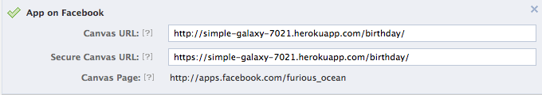
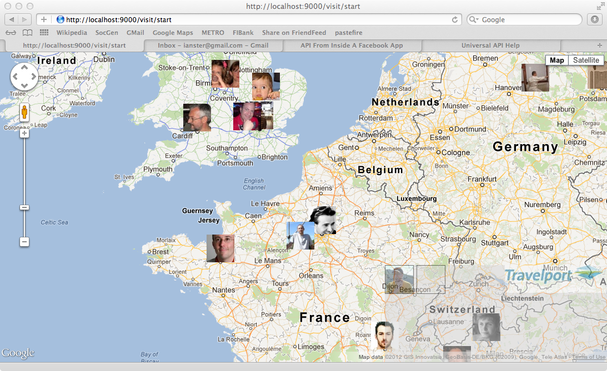
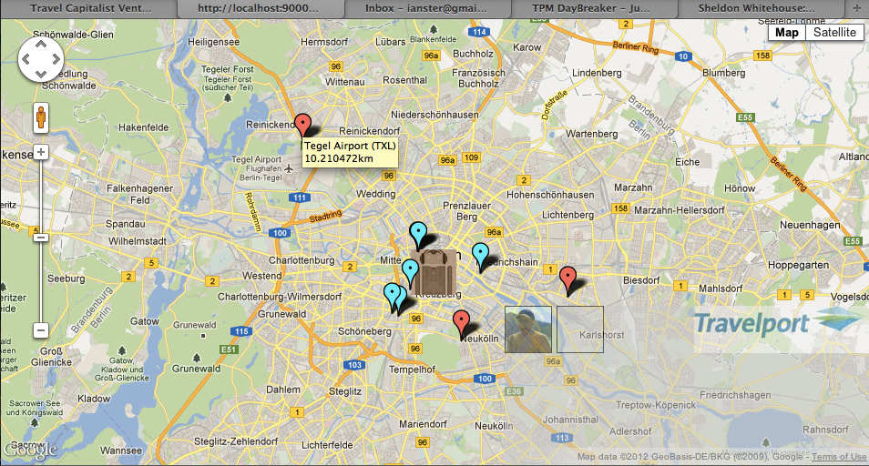
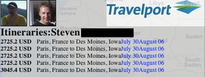
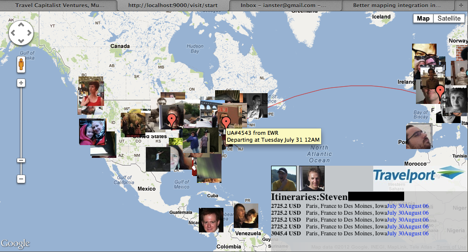



## Unit 3, Lesson 9

### Objective of Lesson 9

Lesson 8 was the steak, Lesson 9 is the sizzle.

In Lesson 9 we show how to build an application that is more interactive than the one in Lesson 8.

The key travel-related topics in this lesson are being more clever with the way you handle the UCode data, and making sure to keep the user interface responsive to the user, even if you are doing more complex calculations in the background.

### More complex uses of UCode

In the [last lesson](lesson_3-8.html) we covered why the UCode data is necessary for dealing with place names.

Last time we used the data to accomplish a relatively simple task: given a place name, compute the nearest airport.  That process is roughly this algorithm:


for each airport in largerUnit
  compute distance to airport

return airport with smallest distance found


"largerUnit" here is either the country name or the state name. This query ends up computing the distance to all the airports in the larger unit, but because the number of airports is relatively small (typically tens, not hundreds) this is manageable.  This approach will clearly not work with all the train stations in heavily-populated european countries with dense train networks.

#### Queries useful for rail

The code for Lesson 9 in `Lesson9.java` allows you to pass in a query to find the nearest "terminal" to your desired location.

For rail terminals, the `st_type` in the UCode data is 2, as opposed to 1 for airports.  In lesson ? we repeatedly try to find a train station for a place with the following queries, in this order:

* Find a train station which has a "city" field that starts with the name of the city we are working with.  This query helps with differences in naming cities like "Perth" versus "Perth South."

* Find a train station which has a "name" field that starts with with the name of the city we are working with.  This allows to find "Huddersfield Central" when searching for a train station for the city "Huddersfield", even though Huddersfield North is not labeled as being in the "city" of Huddersfield.  If it were labelled as being in the same city, the first query would have found it.

* Find a train station whose name contains the name of the city we are looking for.  This query allows us to find stations named "Central Huddersfield" but has a precision problem compared to the previous two queries.  It matches "South Huddersfield"  and "Upper Huddersfield St." as well.

* If the place that is being searched has a "state" field (United States, Canada) then search all the train stations within that state.  In many parts of the United States and Canada, the train stations are very widely dispersed and so this allows _something_ to be found for almost any city in the US or Canada.

### Setting up Lesson 9

Because this lesson will make extensive use of [Google Maps](https://developers.google.com/maps/documentation/javascript/) API, you need an API key for this tool.  These are freely available by following [the instructions](https://developers.google.com/maps/documentation/javascript/tutorial#api_key) in the Google Maps [Getting Started Guide](https://developers.google.com/maps/documentation/javascript/tutorial).

#### Environment

Via heroku, you must have all the following variables defined in your environment.  These are the various parameters for Facebook, Travelport and Google Maps that we would rather put into the source code of an application.   You can check these with `heroku status`:


FBAPPID             => YOUR_FACEBOOK_APP_ID_
FBCHANNEL           => http://your_heroku_hostname/assets/channel.html
FBSECRET            => YOUR_FACEBOOK_APP_SECRET_
GOOGMAPSKEY         => YOUR_GOOGLE_MAPS_API_KEY
TPGDS               => 1V
TPPASSWORD          => YOUR_TRAVELPORT_PASSWORD
TPTARGETBRANCH      => YOUR_TRAVELPORT_BRANCH
TPUSERNAME          => YOUR_TRAVELPORT_USERNAME



#### Facebook Settings

 

 

As in [lesson 8](lesson_3-8.html), you'll need to adjust the URL of your Facebook application to point to a different URL running on our heroku system.  This url is `/visit/start/` in your heroku application. 

When you go to your Facebook application you'll see a full screen map application and icons of your friends will "drop in from above" as they are loaded from Facebook.  

 

 

#### Seeing UCode results

You can see the results of the UCode queries by using right-click or control-click (Windows or Macintosh) on a friend's icon.  When you do this, the view on the map will zoom to include the UCode results.  Airports will be marked with red markers and train stations with blue markers.  Here is a screen capture for a friend based in the German city of Berlin.  You can see the three nearby airports as well as the central train stations in Berlin.  In this screen capture you can also see the "hover" message for the name and distance to a marker.  This visualization shows how far from central Berlin Tegel airport is compared to the train stations!

 

 

#### Selecting a friend to visit

In the lower right corner, you see an "semi-transparent" overlay with the icon of the author, pulled from Facebook, and the Travelport logo.  This is where results are displayed when you click on a friend.  Here's a screen capture of that area after clicking on a friend from Des Moines, Iowa.

 

 

When showing results of a `LowFareSearch` query to the Travelport "Air" service on LowFareSearch port, the display becomes less transparent and displays the lowest priced results. The "links" on the far right of the display in blue are clickable and generate detailed information about either the outbound or return trip.

Below is a screen capture after clicking on an itinerary shown above, outbound from Paris.

 

 

At the zoom level used above the display is a bit cluttered, but it clearly shows the plane's route of travel---a geodesic, or [great circle](http://en.wikipedia.org/wiki/Great_circle).  The markers show aiports used in the route (these are always on top) and by hovering over a marker one can get flight details for that segment.

### Behind The Curtain

The user interface for this application, including the the Facebook integration, is done entirely in Javascript using the Facebook and Google maps libraries.  These are not really within the scope of the tutorial, so we will focus on the uAPI specific issues with this application.

#### nearestTerminal()

There are primarily two functions in `Lesson9` controller, implemented in Lesson9.java.  These functions are `nearestTerminal()` and `go()`.  The first of these, `nearestTerminal` has the following signature:


public static Result nearestTerminal(String name, String lat, String lon)


The method `nearestTerminal` is mapped to the url namespace at `/visit/terminal` and all the parameters are passed a "query parameters", or the bunch of gunk after the question mark in a URL.

`nearestTerminal` takes a place name from Facebook, as we discussed in [Lesson8](lesson_3-8.html), and returns the nearest air and rail terminals for that place. The `lat` and `long` are also derived from Facebook's data about the place.  The result is a collection of JSON-encoded results, that are formatted like this:


[
  {
    "distance": 6.594323,
    "name": "Paris Issy-Les-Moulineaux Heliport",
    "iata_code": "JDP",
    "ucode": "",
    "city": "Paris Issy-Les-Moulineaux Heliport",
    "country": "France",
    "state": "",
    "type": 1,
    "significant": "false",
    "lon": 2.28,
    "lat": 48.82
  },
  {
    "distance": 14.532069,
    "name": "Le Bourget Airport",
    "iata_code": "LBG",
    "ucode": "",
    "city": "Paris",
    "country": "France",
    "state": "",
    "type": 1,
    "significant": "false",
    "lon": 2.45,
    "lat": 48.97
  },
  {
    "distance": 15.346797,
    "name": "Orly Airport",
    "iata_code": "ORY",
    "ucode": "T87A0018",
    "city": "Paris",
    "country": "France",
    "state": "",
    "type": 1,
    "significant": "true",
    "lon": 2.38,
    "lat": 48.72
  },
  {
    "distance": 37.73676,
    "name": "Charles de Gaulle Airport",
    "iata_code": "CDG",
    "ucode": "U8727146",
    "city": "Paris",
    "country": "France",
    "state": "",
    "type": 1,
    "significant": "true",
    "lon": 2.55,
    "lat": 49.17
  },
  {
    "distance": 67.00149,
    "name": "Tille Airport",
    "iata_code": "BVA",
    "ucode": "U8731351",
    "city": "Beauvais",
    "country": "France",
    "state": "",
    "type": 1,
    "significant": "true",
    "lon": 2.0638,
    "lat": 49.4294
  },
  {
    "distance": 0.30231175,
    "name": "Paris Chatelet",
    "iata_code": "",
    "ucode": "U8755584",
    "city": "",
    "country": "France",
    "state": "",
    "type": 2,
    "significant": "false",
    "lon": 2.3469,
    "lat": 48.8576
  },
  {
    "distance": 1.7741668,
    "name": "Paris Musee d'Orsay",
    "iata_code": "",
    "ucode": "U8750394",
    "city": "",
    "country": "France",
    "state": "",
    "type": 2,
    "significant": "false",
    "lon": 2.3271,
    "lat": 48.8601
  },
  {
    "distance": 2.1954446,
    "name": "Paris Austerlitz RER",
    "iata_code": "",
    "ucode": "U8726403",
    "city": "",
    "country": "France",
    "state": "",
    "type": 2,
    "significant": "false",
    "lon": 2.3686,
    "lat": 48.8408
  },
  {
    "distance": 2.3251019,
    "name": "Paris Austerlitz",
    "iata_code": "",
    "ucode": "U8754700",
    "city": "",
    "country": "France",
    "state": "",
    "type": 2,
    "significant": "false",
    "lon": 2.3682,
    "lat": 48.8392
  },
  {
    "distance": 2.3261125,
    "name": "Paris Est",
    "iata_code": "XHP",
    "ucode": "U8711300",
    "city": "",
    "country": "France",
    "state": "",
    "type": 2,
    "significant": "false",
    "lon": 2.3591,
    "lat": 48.8769
  }
]


The return values are, in order, the nearest airports, the nearest major airports, and the nearest rail stations.  This data is all provided via the UCode database.  

For the rail stations, we use the approach detailed above where we make a series of different queries trying to find "good" matches with the location or name of the station.  It should be clear from this data that this data is the basis for the "show UCode data" functionality in the application.
ince airports are far less numerous, we check all the airports listed in the geographic unit (country or state) and find the closest few.  We differentiate major airports based on the UCode column `is_significant`.

If you want to control the number of results returned in any of these categories, you can control this with a parameter to `Lesson8.nearestTerminal`.  One of the parameters to this method is the number of results to return.  It's called once for each "type" of result desired and the current values are a maximum of three not-significant airports, a maximum of three significant airports, and a maximum of five train stations.  If there is overlap between the significant and not-significant airport results, the duplicates are remove from the not-significant set of results.

For each location we can find in the list of friends of the current user, we end up make a call from the _client-side_, the web browser, to the server code.   This request is a normal web "GET" request, but launched from the javascript code, not the "url bar" or the user "clicking on a link." The server code, obviously, is written in Java but returns its result in JSON format.  Returning JSON-formatted data makes it easier to process on the client side, since this is the "native" format of Javascript.  

#### go()

In concept, the `go` method of `Lesson9` functions similarly to the nearestTerminal() method.  It is called from the javascript, client-side code and returns JSON-encoded results.  `Go()` however is responsible for calling the Travelport uAPI to get the pricing results.  `Go()` takes parameters like this:


public static Result go(String outboundDate ,String returnDate,
        String originName, String originLat, String originLon,
        String destName, String destLat, String destLon)


This function looks remarkably like the one we used in [Lesson 3](lesson_1-3.html) which was called `createLowFareSearchWithRail`... because they both are doing a uAPI Low Fare Search!  The version in
Lesson 9 does not include rail in it's request at the moment (see below!).  A big difference with this version is that we supply to the called Java code the names of the origin and destination.  These are used to compute nearby airports, just as was done in the previous section on nearestTerminal.  Also, these "named places" (`FBNamedPlace` in the Java code) echoed back to the caller in the resulting JSON to make generating the displayed results easier; it prevents the client from needing to do bookkeeping to match which results are for which requests.  The client may have several requests in progress at once!

Again, the result is a JSON encoded "blob" of text.  The top level of structure is just a collection of results.  Each result is information about the query more generally, again for the convenience of the client side,  and then each segment that is part of the result.    Here is a sample response from the `go()` method for a search between Paris, France and New Orleans, Louisiana in the USA:


[
  {
    "price": 2114.2,
    "currency": "USD",
    "outboundDate": "July 30",
    "returnDate": "August 06",
    "orig": "Paris, France",
    "dest": "New Orleans, Louisiana",
    "seg": [
      {
        "origin": "ORY",
        "dest": "LHR",
        "flight": "6228",
        "carrier": "AA",
        "depTime": "Monday July 30 08AM",
        "originLat": 48.72,
        "originLon": 2.38,
        "destLat": 51.47,
        "destLon": -0.45
      },
      {
        "origin": "LHR",
        "dest": "ORD",
        "flight": "87",
        "carrier": "AA",
        "depTime": "Monday July 30 11AM",
        "originLat": 51.47,
        "originLon": -0.45,
        "destLat": 41.98,
        "destLon": -87.9
      },
      {
        "origin": "ORD",
        "dest": "MSY",
        "flight": "3684",
        "carrier": "AA",
        "depTime": "Monday July 30 09PM",
        "originLat": 41.98,
        "originLon": -87.9,
        "destLat": 29.99,
        "destLon": -90.26
      },
      {
        "origin": "MSY",
        "dest": "ATL",
        "flight": "1277",
        "carrier": "DL",
        "depTime": "Tuesday August 07 12AM",
        "originLat": 29.99,
        "originLon": -90.26,
        "destLat": 33.7994,
        "destLon": -84.3924
      },
      {
        "origin": "ATL",
        "dest": "LHR",
        "flight": "6171",
        "carrier": "AA",
        "depTime": "Tuesday August 07 03AM",
        "originLat": 33.7994,
        "originLon": -84.3924,
        "destLat": 51.47,
        "destLon": -0.45
      },
      {
        "origin": "LHR",
        "dest": "ORY",
        "flight": "6229",
        "carrier": "AA",
        "depTime": "Tuesday August 07 01PM",
        "originLat": 51.47,
        "originLon": -0.45,
        "destLat": 48.72,
        "destLon": 2.38
      }
    ]
  },
  {
    "price": 3061.4,
    "currency": "USD",
    "outboundDate": "July 30",
    "returnDate": "August 06",
    "orig": "Paris, France",
    "dest": "New Orleans, Louisiana",
    "seg": [
      {
        "origin": "ORY",
        "dest": "EWR",
        "flight": "7825",
        "carrier": "AA",
        "depTime": "Monday July 30 01PM",
        "originLat": 48.72,
        "originLon": 2.38,
        "destLat": 40.6966,
        "destLon": -74.1822
      },
      {
        "origin": "EWR",
        "dest": "MSY",
        "flight": "1729",
        "carrier": "UA",
        "depTime": "Tuesday July 31 03AM",
        "originLat": 40.6966,
        "originLon": -74.1822,
        "destLat": 29.99,
        "destLon": -90.26
      },
      {
        "origin": "MSY",
        "dest": "EWR",
        "flight": "3570",
        "carrier": "UA",
        "depTime": "Monday August 06 05PM",
        "originLat": 29.99,
        "originLon": -90.26,
        "destLat": 40.6966,
        "destLon": -74.1822
      },
      {
        "origin": "EWR",
        "dest": "ORY",
        "flight": "7824",
        "carrier": "AA",
        "depTime": "Tuesday August 07 12AM",
        "originLat": 40.6966,
        "originLon": -74.1822,
        "destLat": 48.72,
        "destLon": 2.38
      }
    ]
  },
... more results ... 


One interesting thing to note about this data is that each segment's origin and destination are labelled with latitude and longitude.  This is to allow the client-side code to correctly draw the lines on the map and correctly place markers for the stops along the journey.  This data, of course, is _also_ drawn from the UCode data.  This data is not present in the `AirPricingSolution` returned by the uAPI so we post-process the data to determine these coordinates.

### airSupport.price()

Although we discussed a method called `price()` in [lesson 8](lesson_3-8.html), we did not reveal previously that the Lesson 8 version of this method is actually a simplified wrapper around a more complex method of the same name.  The code in lesson 9, notably `go()` uses the more complex interface:


public static List<Journey> price(List<String> destAirport, List<String> originAirport,
         String destName, String originName,
         Date in, Date out, int distance, int num) throws AirFaultMessage


This more complex version allows a bit more flexibility in the search requests, and may be interesting to readers developing their own application. Most notably it allows you to pass a list of airports that are acceptable for the departure and arrival cities and a distance radius for a "nearby" search.  This type of search was explained in more detail in Lesson 2.  Finally, you can control the number of results returned with the last parameter.

### Thanks!

Thanks so much for working through this tutorial and for using the Travelport uAPI!  We really appreciate you spending your time with us in this tutorial.  If you have questions or comments, you can post them to the [issues tracker](https://github.com/travelport/travelport-uapi-tutorial/issues) of this website.  We look forward to your feedback!

### Exercises for the reader

 * Currently the Javascript user interface has no "throttle" to stop it from launching hundreds of web requests to the server at the time the application starts up.  This can lead to the server running out of resources and returning 503 (Server Busy).  Design and implement a new scheme that limits the number of requests that can be made at once to something reasonable, like 4 or 6.  Doing this correctly and without threads on the client side requires keeping a data structure of "pending" requests and checking for pending requests when other requests complete.

 * Based lesson 9 and lesson 3, build a version of Lesson 9's application that returns rail as well as air results.  The only change required to the client-side code might be to introduce an extra field into the JSON values return by go to indicate if the itinerary is rail or air.  Extra points for making the displayed lines of the itinerary be blue for rail and to not use geodesics---since these aren't the way that a train typically travels!

[< Return to Unit 3, Lesson 8](lesson_3-8.html) 

[Table of Contents](index.html)





